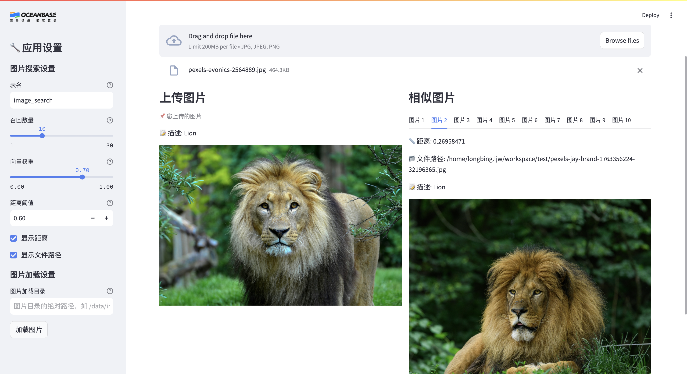

[English](./README.md) | 中文版 | [日本語版](./README_ja.md)

# 图像搜索应用

## 介绍

凭借 OceanBase 的向量存储和检索能力，我们可以构建一个图像搜索应用。该应用会把图像嵌入为向量并存储在数据库中，同时自动生成图像的文本描述。支持向量检索、全文检索以及混合检索三种模式，用户可以上传图像，应用程序将搜索并返回数据库中最相似的图像。

**主要特性**：
- **向量检索**：基于图像视觉特征的相似度搜索
- **自动描述生成**：使用 API（如 Qwen-VL）自动生成图像文本描述
- **混合检索**：结合向量检索和全文检索，提升搜索准确度
- **可调节权重**：支持调整向量和文本的权重比例（0.0-1.0）
- **距离阈值过滤**：可设置距离阈值过滤搜索结果

注意：您需要自己准备一些图像并将 `Image Base` 配置更新到打开的 UI 中。如果您本地没有可用的图像，可以在线下载数据集，例如在 Kaggle 上的 [Animals-10](https://www.kaggle.com/datasets/alessiocorrado99/animals10/data) 数据集。

## 准备工作

1. 安装 [Python 3.9](https://www.python.org/downloads/) 及以上版本及对应的 [Pip](https://pip.pypa.io/en/stable/installation/) 工具

2. 安装 [Docker](https://docs.docker.com/get-docker/) 用于启动 seekdb 数据库容器

3. 安装 [uv](https://github.com/astral-sh/uv) 作为依赖管理工具，可参考下面的命令

```bash
python3 -m pip install uv
```

4. 获取 seekdb 数据库连接信息

## 应用搭建步骤

### 1. 部署 seekdb

使用以下命令启动一个 seekdb docker 容器：

```bash
docker run -d -p 2881:2881 -p 2886:2886 --name seekdb oceanbase/seekdb
```

如果需要数据持久化，可以挂载数据目录：

```bash
# Linux 或 MacOS
mkdir -p seekdb
docker run -d -p 2881:2881 -p 2886:2886 \
  -v $PWD/seekdb:/var/lib/oceanbase \
  --name seekdb oceanbase/seekdb

# Windows
docker volume create seekdb
docker run -d -p 2881:2881 -p 2886:2886 \
  -v seekdb:/var/lib/oceanbase \
  --name seekdb oceanbase/seekdb
```

如果需要了解更多 seekdb 的配置和使用方法，可以参考 [seekdb 官方仓库](https://github.com/oceanbase/seekdb)。

### 2. 安装依赖

```bash
uv sync
```

### 3. 配置环境变量

我们提供了 `.env.example` 文件，您需要将其复制为 `.env` 文件并填入您的数据库连接信息和 API 配置。可参考下面的命令，

```bash
cp .env.example .env
vi .env
```

**必需配置**：
- `DB_HOST`, `DB_PORT`, `DB_USER`, `DB_PASSWORD`, `DB_NAME`：数据库连接信息
- `API_KEY`：图像描述生成 API 密钥（如通义千问 DashScope 的 API Key）
- `BASE_URL`：API 地址（默认：`https://dashscope.aliyuncs.com/compatible-mode/v1`）
- `MODEL`：模型名称（默认：`qwen-vl-max`）

### 4. 启动图像搜索 UI

```bash
uv run streamlit run --server.runOnSave false image_search_ui.py
```

### 5. 处理并存储图像数据

打开应用界面之后，您可以在左侧侧边栏中看到"图片加载目录"的输入框，在其中填写您准备的图片目录的绝对路径，然后点击"加载图片"按钮。应用程序将处理并存储这些图像数据，您将在界面上看到图片处理进度。

### 6. 使用图像搜索

在图片处理完成后，您将在界面中上方看到图片上传操作栏，您可上传一张图片用于搜索相似图片。应用程序将搜索并返回数据库中最相似的一些图片。

#### 检索参数说明

- **召回数量**：返回的相似图片数量（1-30，默认 10）
- **向量权重**：控制检索模式
  - `1.0`：纯向量检索（仅基于图像视觉特征）
  - `0.7`（推荐）：混合检索，向量为主，文本为辅
  - `0.5`：向量和文本等权重
  - `0.0`：纯文本检索（仅基于图像描述匹配）
- **距离阈值**：只显示向量距离小于等于该值的结果（默认 0.6，仅对向量检索部分生效）

#### 搜索结果

每个搜索结果将显示：
- 相似图片
- 图片描述
- 相似度距离（距离越小越相似，仅在向量检索时显示）
- 文件路径



## 常见问题

### 1. 如何获取图像描述 API Key？

本应用需要使用支持 OpenAI 兼容接口的视觉模型 API 来生成图像描述。推荐使用**通义千问 Qwen-VL**：

1. 访问 [阿里云 DashScope](https://dashscope.aliyun.com/)
2. 开通通义千问服务
3. 创建 API Key
4. 在 `.env` 文件中配置 `API_KEY`

也可以使用其他支持 OpenAI 兼容接口的服务（如 GPT-4V、Azure OpenAI 等），需要相应修改 `BASE_URL` 和 `MODEL` 配置。

### 2. 遇到找不到 libGL.so.1 文件的报错怎么办？

如果您在运行应用 UI 时遇到了 `ImportError: libGL.so.1: cannot open shared object file` 的报错信息，可参考[该帖子](https://stackoverflow.com/questions/55313610/importerror-libgl-so-1-cannot-open-shared-object-file-no-such-file-or-directo)解决。

在 CentOS 操作系统中，执行以下命令,

```bash
sudo yum install mesa-libGL -y
```

在 Ubuntu/Debian 操作系统中，执行以下命令,

```bash
sudo apt-get install libgl1
```

### 3. 如何选择合适的向量权重？

根据您的搜索需求选择合适的向量权重：

- **0.9-1.0**：图片视觉相似性最重要（如找相似构图、颜色、风格的图片）
- **0.6-0.8**：视觉为主，语义为辅（推荐，平衡效果最好）
- **0.3-0.5**：视觉和语义同等重要
- **0.0-0.2**：语义最重要（如"找所有狐狸"，不管视觉差异）

### 4. 遇到找不到 pkg_resources 包的报错怎么办？

如果您在运行应用 UI 时遇到了 `ModuleNotFoundError: No module named 'pkg_resources'` 的报错信息，可参考[该帖子](https://stackoverflow.com/questions/7446187/no-module-named-pkg-resources)解决。

具体来说，可以参考下面两条命令，

```bash
python3 -m pip install --upgrade pip
python3 -m pip install setuptools
```
